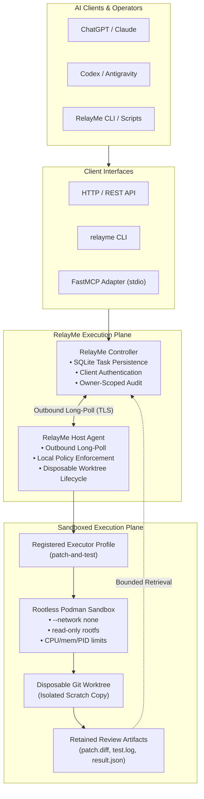

# RelayMe

**A secure execution plane for AI agents operating on remote machines.**

AI coding and operations agents increasingly need to inspect, patch, test, and diagnose real systems. However, giving remote AI models arbitrary SSH access or raw shell execution (`run_shell`) is dangerous, fragile, and difficult to audit. Furthermore, ephemeral agent sessions make long-running tasks unreliable.

RelayMe bridges this gap by acting as a secure, vendor-neutral execution plane underneath AI orchestrators. Instead of arbitrary remote shell access, RelayMe provides:

- **Capability-Scoped Authorization**: Clients execute only pre-authorized, explicitly registered task specifications.
- **Durable Task Lifecycle**: SQLite-backed tasks with atomic idempotency, replayable results, and audit trails.
- **Isolated Disposable Worktrees**: Code changes occur in transient Git worktrees, keeping source repositories immutable.
- **Rootless Sandboxing**: Containerized execution via rootless Podman with `--network none`, read-only roots, and strict resource limits.
- **Bounded Reviewable Artifacts**: Retained patches (`patch.diff`), test logs (`test.log`), and structured outcomes (`result.json`) for subsequent model review.
- **Universal Client Interfaces**: Seamless parity across HTTP/REST, CLI, and FastMCP (Model Context Protocol).

---

## What RelayMe Is NOT

To keep system boundaries clear:

- **NOT another coding agent**: RelayMe does not write code or prompt LLMs. Models like ChatGPT, Claude, Codex, or Antigravity act as external clients.
- **NOT an orchestration engine**: RelayMe does not decide next steps, manage multi-agent loops, or direct research.
- **NOT merely an MCP server**: FastMCP is an adapter interface; RelayMe's primary system is the execution, policy enforcement, and security layer underneath.
- **NOT arbitrary remote shell access**: RelayMe strictly rejects arbitrary shell commands, raw interpreter evaluations, and ad-hoc script uploads.

---

## Architecture



---

## Why RelayMe?

| Dimension | Naive `run_shell` MCP Tool | RelayMe Execution Plane |
|---|---|---|
| **Access Model** | Unrestricted shell (`/bin/sh -c ...`) | Pre-registered capabilities & task specs |
| **Authorization** | All-or-nothing system access | Exact capability and profile scoping per token |
| **Network Egress** | Host network access / data exfiltration risk | Enforced `--network none` by default |
| **Filesystem Safety** | Writes directly to host source tree | Isolated disposable worktrees; source repo immutable |
| **Privilege** | Runs as host user or root | Rootless Podman with non-root Agent-derived UID/GID |
| **Task Lifecycle** | Ephemeral process tied to client socket | Durable SQLite-backed tasks with idempotency & replay |
| **Results & Review** | Unbounded stdout dumped into LLM context | Bounded artifacts (`patch.diff`, `test.log`) for later review |
| **Enforcement** | Client-side trust | Agent-side local policy is final boundary |

---

## End-to-End Walkthrough (CLI)

Below is the standard workflow where an external client dispatches a bounded `patch-and-test` task and retrieves reviewable evidence:

### 1. Discover Registered Resources & Profiles
```sh
# Discover hosts and registered profiles visible to the client token
relayme hosts
relayme list-host-resources HOST_ID
```

### 2. Start a Bounded Executor Task
The client specifies only the host, registered profile ID, the fixed `patch-and-test` task spec, a brief, and an optional idempotency key:
```sh
relayme start-executor-task HOST_ID research-patch-test patch-and-test \
  "Fix off-by-one error in pagination parser" \
  --idempotency-key task-fix-101
```

### 3. Check Task Status & Results
```sh
# Inspect terminal outcome and execution duration
relayme task-result TASK_ID
```

### 4. Retrieve Bounded Review Artifacts
Retrieve structured artifacts generated inside the container sandbox without needing SSH or host filesystem access:
```sh
# Retrieve the generated unified diff
relayme task-artifact TASK_ID patch.diff

# Retrieve the test execution log
relayme task-artifact TASK_ID test.log

# Retrieve the structured analysis or outcome
relayme task-artifact TASK_ID analysis.md
```

### 5. Review & Idempotency Replay
External agents or human reviewers evaluate the patch and test results. Repeating the `start-executor-task` call with the same idempotency key returns the retained result immediately without re-executing.

---

## Capabilities & MCP Tools

RelayMe exposes 13 tools across HTTP, CLI, and standard FastMCP stdio:

### Read-Only Observation (R0)
- `list_hosts`: List enrolled hosts visible to the caller's token.
- `list_host_resources`: List registered services, repositories, and allowed file roots for a host.
- `host_status`: Bounded host health, load, and resource status.
- `process_list`: List host processes safely.
- `read_logs`: Retrieve bounded service logs for a registered service.
- `read_file`: Read a file strictly within Agent-allowed filesystem roots.
- `git_diff`: Read the Git diff of a registered repository.

### Bounded Execution (R1)
- `run_registered_task`: Run a locally registered, fixed binary command with no arguments.
- `start_registered_executor_task`: Start a registered `patch-and-test` container execution inside a disposable worktree.

### Task Management & Artifact Review
- `get_task`: Query task status and lifecycle metadata.
- `task_result`: Retrieve durable terminal results and artifact manifests.
- `list_reviewable_tasks`: List completed executor tasks with retained evidence.
- `get_task_artifact`: Retrieve bounded text artifacts (`patch.diff`, `result.json`, `test.log`, `analysis.md`).

---

## Scope Boundaries & Non-Goals (v0.4.1)

To maintain strict operational safety, RelayMe enforces deliberate design limits:

- **`patch-and-test` Only**: The executor runtime is purpose-built for the single `patch-and-test` task specification; general arbitrary job scheduling is not supported.
- **No Arbitrary Shell**: Tasks execute registered binaries directly; no interactive shell interpreters or arbitrary command strings.
- **No Upstream Mutations (No R2)**: Modifications occur strictly in disposable worktrees. RelayMe does not commit or push changes to upstream branches.
- **No GPU Scheduler**: RelayMe does not manage GPU allocations or distributed cluster queues.
- **Vendor-Neutral Core**: RelayMe Core contains no LLM provider APIs, proprietary token protocols, or vendor-specific prompt templates.
- **No Autonomous Workflow Engine**: RelayMe is a secure compute/state bridge, not a reasoning agent.
- **Deployment-Local Provider Profiles**: External provider credentials and proxy configs remain strictly deployment-local and decoupled from RelayMe Core.

---

## Security Model

- **Agent Is Final Authority**: The Host Agent evaluates and enforces all policies locally. It never trusts the Controller or client tokens blindly.
- **Outbound Long-Polling**: Managed hosts initiate outbound TLS connections to the Controller. No inbound ports or firewall holes are opened on target systems.
- **Rootless Container Sandboxing**: Executor tasks run in rootless Podman with `--network none`, read-only root filesystems, and strict CPU/memory/PID limits.
- **Identity Isolation**: Supports `user_namespace: "keep-id"` combined with derived non-root Agent UID:GID (`execution_identity: "agent"`), preventing container root escalation.
- **Source Repository Immutability**: Tasks run in isolated disposable Git worktrees that are pruned after execution; host repositories remain pristine.
- **Bounded Artifact Retrieval**: Artifact retrieval is restricted to declared manifest names (`patch.diff`, `result.json`, `test.log`, `analysis.md`) with a strict 100,000-byte cap, directory traversal rejection, and symlink protection.
- **Cryptographic Token Scoping**: Controller tokens are hashed in SQLite and enforce exact capability scopes (`list_hosts`, `run_registered_task:<task_id>`, `run_executor_task:<profile_id>`).

---

## Getting Started

### Requirements
- Python 3.10+
- Podman (for executor tasks)

### Installation
```sh
pip install .
```

### Quickstart

1. **Start the Controller**:
   ```sh
   relayme-controller --db relayme.db --bootstrap-token CHANGE_ME_ADMIN_TOKEN
   ```

2. **Provision Scoped Client Tokens**:
   Scoped tokens are issued locally via the Controller CLI (never over public HTTP):
   ```sh
   relayme admin --db relayme.db create-client \
     --name agent-client \
     --capability list_hosts \
     --capability list_host_resources \
     --capability run_executor_task:research-patch-test \
     --output-file client-token.txt
   ```

3. **Start the Host Agent**:
   Configure [`examples/agent.example.json`](examples/agent.example.json) and start the agent:
   ```sh
   relayme-agent --config agent.json
   ```

4. **Run the Generic FastMCP Adapter**:
   Configure the client environment (see [`examples/mcp.env.example`](examples/mcp.env.example)):
   ```sh
   export RELAYME_URL=http://127.0.0.1:8765
   export RELAYME_TOKEN=$(cat client-token.txt)

   relayme-mcp
   ```

---

## Project Status

- **Version**: 0.4.1 (Stable Release)
- **Automated Tests**: 66 passing tests (58 core/security unit tests, 8 MCP adapter tests)
- **External Validation**: Verified end-to-end with external Antigravity MCP client on real Linux hosts.
- **License**: [Apache 2.0](LICENSE)
