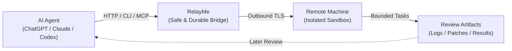

<p align="center">
  
</p>

# RelayMe

**Give ChatGPT and other AI agents safe, persistent hands on remote machines — without arbitrary shell access.**

AI agents need to act in the real world: inspect systems, run experiments, and execute bounded tasks. But giving remote models unrestricted shell or SSH access (`run_shell`) is dangerous, and ephemeral chat sessions make long-running work fragile.

RelayMe is a secure, vendor-neutral execution bridge. It lets AI agents observe remote machines, run registered bounded tasks in isolated sandboxes, and retrieve structured artifacts for review — safely, durably, and across session boundaries.



## What Can I Do with RelayMe?

- **Inspect remote systems safely**: Let an agent query system status, processes, service logs, and git diffs without opening inbound ports or granting SSH access.
- **Run bounded research & test tasks**: An AI research lead can inspect an experiment, launch a pre-registered benchmark or test run, disconnect, and retrieve logs later to plan the next step.
- **Sandboxed code execution**: Run bounded containerized tasks (such as `patch-and-test`) in disposable Git worktrees where source repositories stay immutable.
- **Durable multi-session workflows**: Return hours later or hand off work between models—tasks persist in SQLite with atomic idempotency and replayable results.
- **Vendor-neutral integration**: Works with ChatGPT, Claude, Codex, Antigravity, or custom agents via standard HTTP, CLI, and Model Context Protocol (MCP).

## How It Works

- **Controller (Broker)**: Authenticates clients, tracks task state in SQLite, and serves as the central rendezvous point.
- **Host Agent (Executor)**: Runs on the target machine, long-polls the Controller over outbound TLS, and enforces local security policies.
- **Client Interface**: Agents interact through standard REST APIs, the `relayme` CLI, or a 13-tool FastMCP stdio server.

## Example: Bounded Patch & Review

An external agent or engineer dispatches a bounded task, disconnects, and inspects the retained artifacts later:

```sh
# 1. Start a bounded task in an isolated disposable worktree
relayme start-executor-task host-1 research-patch-test patch-and-test \
  "Fix off-by-one error in pagination parser" --idempotency-key fix-101

# 2. Check execution status and retrieve the generated diff and test log
relayme task-result <TASK_ID>
relayme task-artifact <TASK_ID> patch.diff
relayme task-artifact <TASK_ID> test.log
```

The agent reviews the retrieved artifacts directly—without host filesystem access or repository mutations.

## Why Not Just MCP or SSH?

- **MCP is a protocol, not an execution engine**: MCP tells an agent *how to call a tool*. RelayMe provides the authorization, isolation, state persistence, and artifact storage *behind* those tools.
- **No arbitrary `run_shell`**: Instead of unconstrained `/bin/sh -c` access, RelayMe enforces locally registered task specifications, `--network none` rootless sandboxes, and immutable source trees.
- **Outbound-only connections**: Target machines initiate outbound TLS polling to the Controller—no open inbound ports, no VPN holes, no SSH keys shared with models.

## Safety by Default

- **Host Agent is the final authority**: Local policies cannot be overridden by clients or Controller tokens.
- **Rootless container isolation**: Tasks run in rootless Podman with `--network none`, read-only roots, and Agent-derived non-root identities (`keep-id`).
- **Disposable Git worktrees**: Host source trees are never modified directly.
- **Bounded review artifacts**: Artifact retrieval is restricted to declared files with strict byte limits and directory traversal guards.

## Current Scope (v0.4.1)

**Implemented in v0.4.1**:
- Remote observation (R0): hosts, resources, status, processes, logs, files, git diffs.
- Bounded registered task execution (R1) & containerized `patch-and-test` executor.
- Durable SQLite task state, idempotency replay, and 13-tool FastMCP stdio adapter.
- Verified end-to-end with external Antigravity/ChatGPT MCP clients on real Linux hosts.

**Explicit Non-Goals (v0.4.1)**:
- No arbitrary remote shell execution or interactive terminal sessions.
- No automatic upstream Git commit/push (R2 mutation) or deployment orchestration.
- No GPU cluster scheduling or autonomous research workflow engine.
- Provider credentials and container runtime profiles remain deployment-local.

## Documentation

- [Architecture & Detailed Setup](docs/architecture.md) — Controller, Agent, and CLI setup guide.
- [Security Model & Disclosure](SECURITY.md) — Defense-in-depth architecture and vulnerability reporting.
- [Changelog](CHANGELOG.md) — Version history and release notes.

## License

[Apache 2.0](LICENSE)
