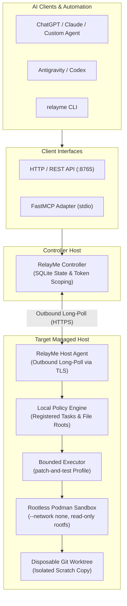

# RelayMe Architecture & Guide

RelayMe is an execution and observation bridge designed to connect AI agent interfaces with remote execution environments securely.

## Core Principles

- **Controller + Host Agent**: The Controller acts as an authenticated state broker; the Host Agent runs on the target machine and long-polls the Controller for tasks over outbound TLS.
- **Agent-Side Authority**: The Host Agent enforces all capability, filesystem, process, and sandboxing boundaries locally. Tokens cannot bypass Agent policy.
- **Vendor-Neutral Core**: RelayMe Core contains no LLM provider logic, model-specific prompting, or proprietary authentication mechanisms.
- **SQLite + Filesystem**: The Controller persists task state, hashes client tokens, and tracks execution audit records in SQLite.
- **Rootless Sandboxing**: Coding executor tasks run inside rootless Podman containers with disposable Git worktrees and `--network none`.

---

## Detailed Component Diagram



---

## Local Setup & Quickstart

### 1. Start the Controller
```sh
relayme-controller --db /protected/path/relayme.db --bootstrap-token CHANGE_ME_ADMIN_TOKEN
```
For remote production deployments, supply `--tls-cert` and `--tls-key`.

### 2. Client Provisioning via Admin CLI
Tokens are issued directly on the Controller host by modifying its SQLite database:
```sh
# Issue an observation-only token
relayme admin --db /protected/path/relayme.db create-client \
  --name observer --capability list_hosts --capability host_status \
  --output-file observer-token.txt

# Issue an executor-capable token
relayme admin --db /protected/path/relayme.db create-client \
  --name research-agent \
  --capability list_hosts \
  --capability list_host_resources \
  --capability run_executor_task:research-patch-test \
  --output-file research-token.txt
```

### 3. Start the Host Agent
Configure an agent profile (see [`examples/agent.example.json`](../examples/agent.example.json)) and run:
```sh
relayme-agent --config /path/to/agent.json
```

### 4. Configure FastMCP Adapter
Clients using the Model Context Protocol launch `relayme-mcp` via stdio:
```sh
export RELAYME_URL=https://controller.example.invalid:8765
export RELAYME_TOKEN=$(cat research-token.txt)
# Optional CA for private certs:
export RELAYME_CA_CERT=/path/to/ca.pem

relayme-mcp
```

---

## Capabilities Reference

| Capability | Scope / Description | Safety Boundary |
|---|---|---|
| `list_hosts` | Lists enrolled hosts visible to the token | Tenant/client token scoping |
| `list_host_resources` | Lists services, repos, and allowed file roots | Exposes only pre-registered names |
| `host_status` | Returns system load, memory, disk, and uptime | Read-only; sanitized summary |
| `process_list` | Returns running processes | Read-only; no signals or control |
| `read_logs` | Reads bounded lines from systemd/service logs | Strictly limited to registered services |
| `read_file` | Reads file content within registered roots | Rejects symlink escapes & path traversal |
| `git_diff` | Reads `git diff` for a registered repository | Read-only inspection of working trees |
| `run_registered_task` | Runs pre-registered fixed binary without args | Fixed argv, clean env, non-root user |
| `start_registered_executor_task` | Starts containerized `patch-and-test` task | Disposable worktree, rootless Podman, `--network none` |
| `get_task` | Returns task execution state & audit record | Owner-scoped |
| `task_result` | Returns terminal execution result & metadata | Owner-scoped; bounded output retention |
| `list_reviewable_tasks` | Lists completed executor tasks with evidence | Owner-scoped |
| `get_task_artifact` | Retrieves text artifact (`patch.diff`, `test.log`, etc.) | Max 100,000 bytes; strict filename whitelist |
